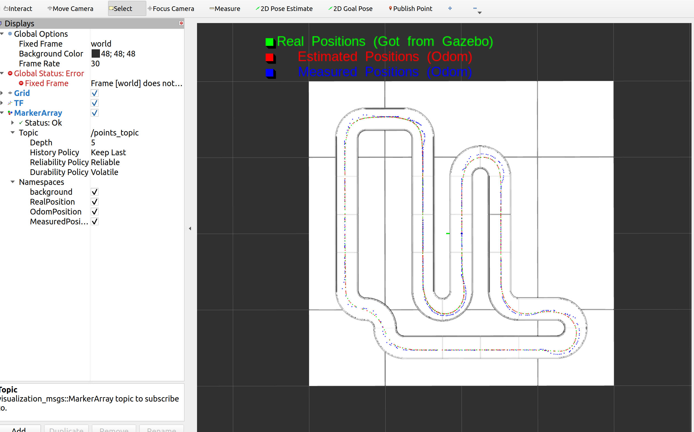

## This document guides users how to run this package

1. Follow below steps to run this package (remember to build and install this package first):
+ Note that add this block to file: turtlebot3_ws/src/turtlebot3_simulations/turtlebot3_gazebo/worlds/turtlebot3_circuit.world to read real position of the robot from gazebo engine
```
<plugin name="gazebo_ros_state" filename="libgazebo_ros_state.so">
    <ros>
    <namespace>/gazebo</namespace>
    <!-- <argument>model_states:=model_states_demo</argument> -->
    </ros>
    <update_rate>10.0</update_rate>
</plugin>
```
+ Run the launch file which includes a circuit path:
```
ros2 launch turtlebot3_gazebo turtlebot3_circuit.launch.py
``` 

+ Run a controller to control the turtlebot3
```
ros2 run turtlebot3_commander start_controler 
```

+ Run a visualizer which will process robot positions exported by the controller and publish to /points_topic for visualizing in Rviz2
```
ros2 run turtlebot3_commander start_visualizer
```
+ Run Rviz2 tool to view robot trajectories, including robot's real potitions (get from gazebo), odom position (odom frame), and measured point position with respect to the odom frame (center of mass point which is used to measure deviation from the X-axis). Remember to add a MarkerArray, then point it to /points_topic to view trajectory and map
``` 
rviz2 
```
